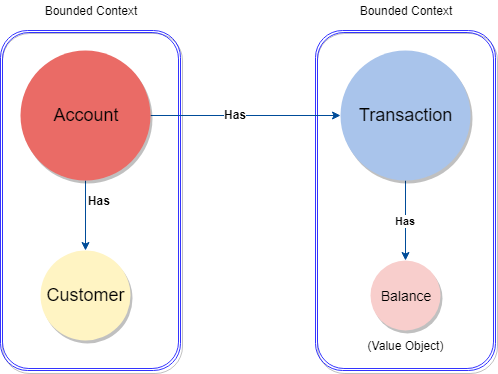
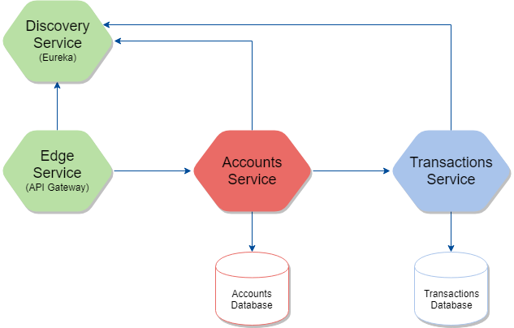

# Cloud Native Accounts System

### Technologies and concepts:

* Java 8
* Spring Framework 5
* Spring Webflux/Reactor
* Spring Data/MongoDB
* Microservice architecture
* Service discovery
* API gateway
* Docker and Docker compose
* Continuous Integration

The following areas are out of the scope so far:

* Security
* Event Sourcing
* CQRS
* Service configuration 

### Domain

The system contains two main bounded contexts:

* Accounts
* Transactions

The accounts bounded context has account as main entity, and customer as a secondary entity, while the Transactions context in this domain has Transaction as main and only entity.

The following diagram shows the contexts, entities and relations: 



*NOTE*: For the sake of simplicity, the customer has been modeled as a secondary entity within the accounts bounded context, but it should be an entire bounded context in a more complete version of this system.

### Microservices

For this system, we are implementing one microserivce per bounded context, plus other non functional services in order to provide service discovery and an entry point for the system.



### Endpoints

The following table contains the system endpoints:

| Endpoint | Method | Scope | Description |
| ------------ | -------------- | -------------- | ------- |
| `/api/accounts` | POST | Public | Creates a new account associated to the specified customer  |
| `/api/accounts?customerId={customerId}` | GET | Public | Retrieves all the accounts, it implements a customerId filter and limit/offset pagination  |
| `/api/accounts/{accountId}` | GET | Public | Retrieves an specific account given the ID  |
| `/api/accounts/{accountId}/transactions` | GET | Public | Retrieves all the transactions of a given account  |
| `/transactions?accountId={accountId}` | GET | Internal | Retrieves all the transactions of an account, it implements offset/size pagination|

### Running

Considerations:

* When run as regular Java applications, each service is built using an in memory MongoDB data bases.
* A docker compose has been provided to run the entire system, including an actual MongoDB database.
* The project must be built before running the system.
* When the system runs there are some accounts and customers loaded in the database.
* When the system runs, it might take a couple of minutes until the services are registered.


Running with docker and docker compose:

```bash
$ mvn clean install
$ docker-compose up --build
```

Running without docker:

```bash
$ mvn clean install
$ java -jar discovery-service/target/discovery-service-1.0.0-SNAPSHOT.jar
$ java -jar transactions-service/target/transactions-service-1.0.0-SNAPSHOT.jar
$ java -jar accounts-service/target/accounts-service-1.0.0-SNAPSHOT.jar
$ java -jar edge-service/target/edge-service-1.0.0-SNAPSHOT.jar
```

Once the system is running, we can try it out with the following commands:

```bash
$ curl -X POST \
  http://localhost/api/accounts \
  -H 'content-type: application/json' \
  -d '{"customerId":"5ab7b1e41fe5db3ac0945a10", "initialCredit":"2000.00", "description": "Personal account"}'
$ curl http://localhost/api/accounts?customerId=5ab7b1e41fe5db3ac0945a10
```

Additionally, a small user interface has been implemented, which will be served in the port 5000 after running the docker compose. 

**NOTE:** In order to run the provided docker compose, the following ports must be free:
* 80 for API Gateway
* 8761 for Eureka
* 5000 for User interface

The microservices will run on random ports, since they are registered and discovered with Eureka.

### Build
[](http://travis-ci.org/armandorvila/cloud-native-accounts)  [](https://codecov.io/github/armandorvila/cloud-native-accounts) [](https://www.codacy.com/app/armandorvila/cloud-native-accounts?utm_source=github.com&amp;utm_medium=referral&amp;utm_content=armandorvila/cloud-native-accounts&amp;utm_campaign=Badge_Grade)
